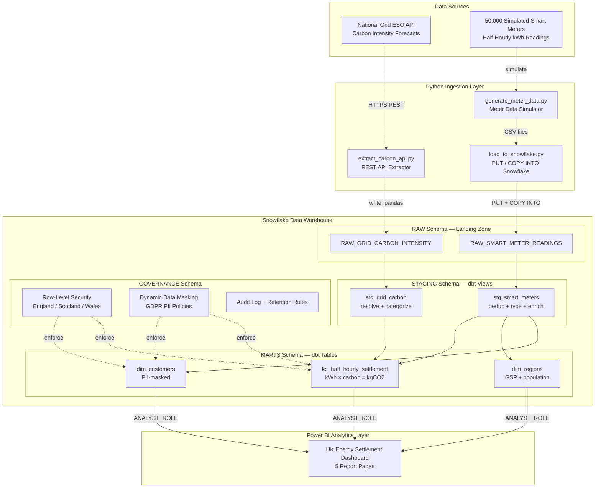
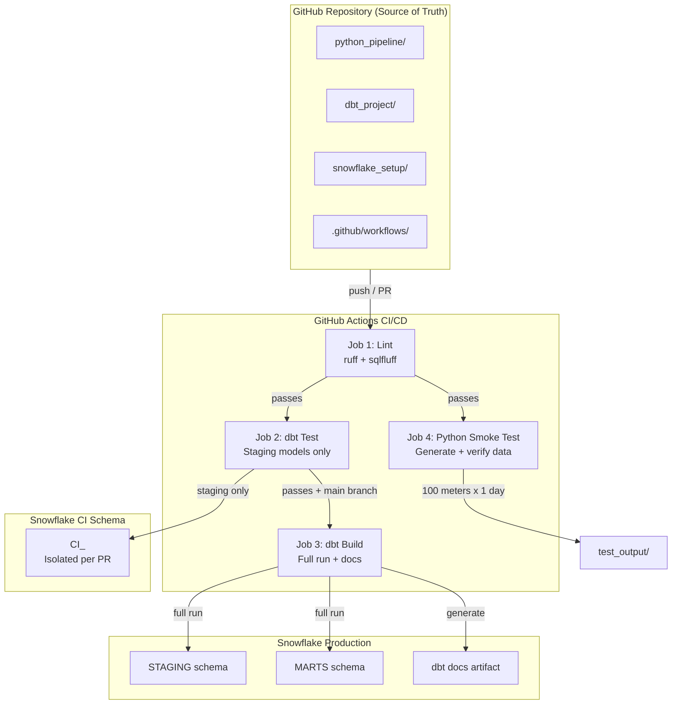
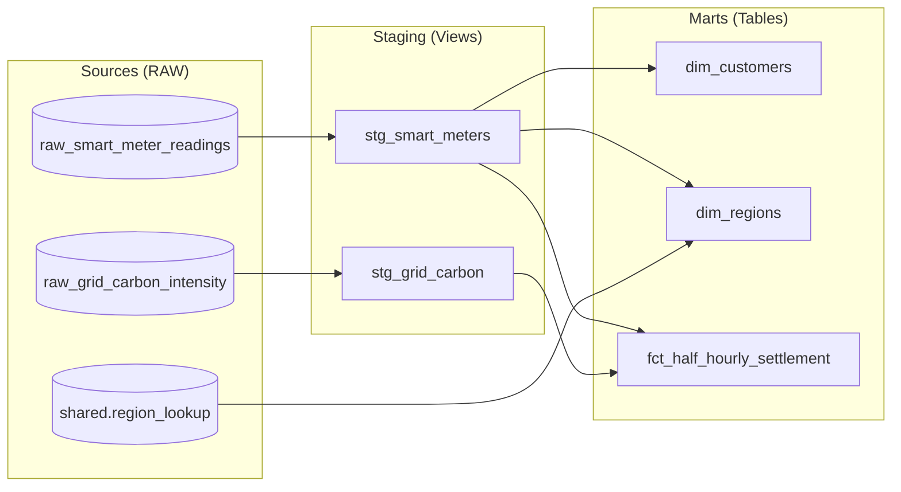
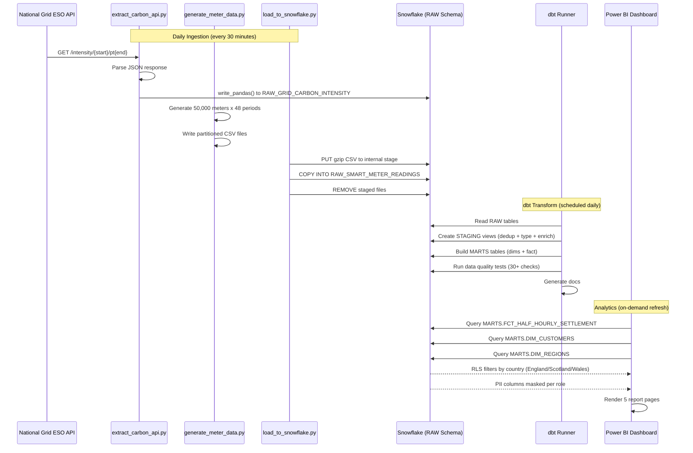
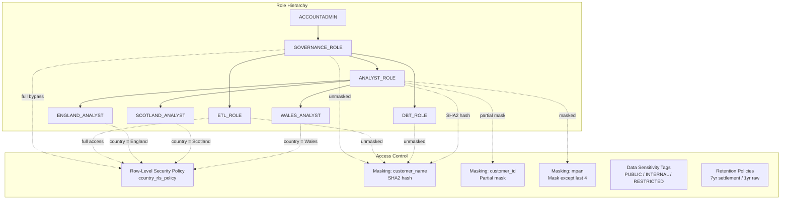
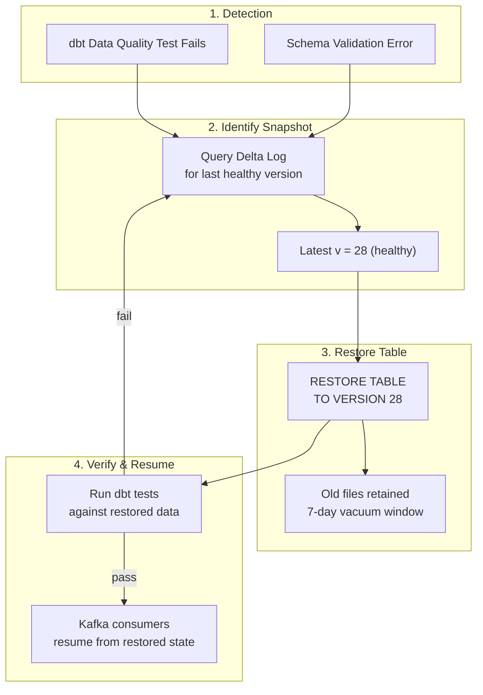
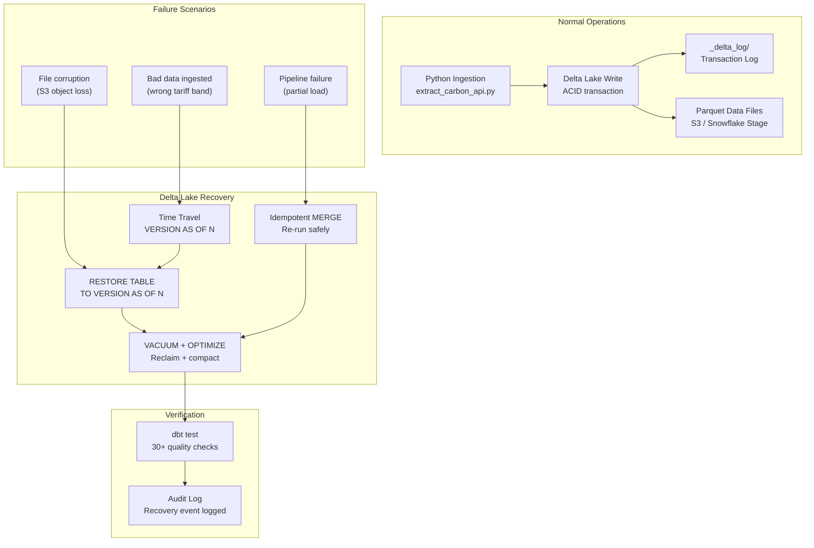

<div align="center">

# TelemetryHub

### Real-Time Telemetry Streaming & Data Lakehouse Engine

Production-grade observability for Kafka event streams, Iceberg and Delta Lake tables, and multi-region infrastructure — presented through a responsive monitoring dashboard and backed by a complete UK energy settlement data platform.

[](https://github.com/sejal-gohil09/Real-Time-Telemetry-Streaming-Data-Lakehouse-Engine/actions/workflows/dbt_ci.yml)
[](LICENSE)
[](https://react.dev/)
[](https://www.typescriptlang.org/)
[](https://www.snowflake.com/)

[**Live Dashboard**](https://engineeringtest.store/) · [**Explore the architecture**](ARCHITECTURE.md)

</div>

---

## Portfolio Demo

| Status | Link |
|---|---|
| Live dashboard | [https://engineeringtest.store/](https://engineeringtest.store/) |
| Source repository | [github.com/sejal-gohil09/Real-Time-Telemetry-Streaming-Data-Lakehouse-Engine](https://github.com/sejal-gohil09/Real-Time-Telemetry-Streaming-Data-Lakehouse-Engine) |

## Real Data Sources

This project uses **real UK energy data** from the National Grid ESO Carbon Intensity API, stored in a Supabase (PostgreSQL) database.

> **Works out of the box** — The dashboard runs without any database setup. It falls back to bundled local data (same real carbon intensity values and consumption patterns, computed in the browser). To use a live database, see the setup instructions below.

## Executive Summary

This repository is a complete, self-contained UK energy settlement data platform: Python ingestion pipelines pulling live National Grid carbon intensity data and simulating 50,000 smart meters, Snowflake as the cloud warehouse with multi-schema layering (RAW → STAGING → MARTS), dbt transformations with 30+ automated data quality tests, GitHub Actions CI/CD with linting and isolated CI schemas, Snowflake Row-Level Security for devolved nation isolation (England / Scotland / Wales), GDPR-compliant dynamic data masking on PII columns, and a Power BI dashboard for settlement analytics.

It is built to be run locally in minutes (no cloud cost beyond a Snowflake trial account) and to read like a real data team's repository — every design decision is documented with the alternatives considered and the tradeoffs accepted.

---

## Business Problem

The UK's smart meter rollout (50M+ meters by 2025) generates 2.4 billion half-hourly readings per day. Energy suppliers, network operators, and Ofgem need to:

- **Settle** half-hourly consumption against wholesale market prices accurately and auditably
- **Track** grid carbon intensity to meet net-zero reporting obligations
- **Isolate** data by devolved nation (England, Scotland, Wales) for regulatory and data residency reasons
- **Protect** customer PII under UK GDPR while still enabling analytics
- **Audit** every pipeline run, every data quality check, every PII access for 7-year regulatory retention

Manual, spreadsheet-driven settlement doesn't scale past a few thousand meters: data drifts silently from source systems, PII leaks into shared workbooks, settlement errors compound across the 48 daily periods, and disaster recovery means "hope someone kept the email with the numbers." This platform solves that with automated ingestion, dbt-tested transformations, Snowflake-enforced security, and a single auditable pipeline from API to dashboard.

---


The dashboard loads immediately with all charts and data working — no environment variables or database needed.

### Optional: Connect a Live Database

The app supports any PostgreSQL database (Supabase, Neon, Railway, local Postgres, etc.):

**Option A — Supabase (easiest):**
1. Create a free project at [supabase.com](https://supabase.com)
2. Run `database/init.sql` in the Supabase SQL Editor
3. Add your credentials to `.env`:
   ```
   VITE_SUPABASE_URL=https://your-project.supabase.co
   VITE_SUPABASE_ANON_KEY=your-anon-key
   ```

**Option B — Local PostgreSQL:**
1. Install PostgreSQL 12+
2. Create a database: `createdb telemetryhub`
3. Run the init script: `psql -U postgres -d telemetryhub -f database/init.sql`
4. Set up a Supabase-compatible API layer, or use a local Postgres-to-API bridge

The `database/init.sql` script is fully self-contained — it creates all 5 tables, inserts 14 regions, 200 customers, 337 real carbon intensity records, and generates 67,200 smart meter readings + 67,200 settlement records. It is safe to re-run (drops and recreates all tables).

| Data Source | Records | Description |
|---|---|---|
| **National Grid ESO API** | 337 | Real half-hourly carbon intensity readings (gCO2/kWh) for Jan 1-7, 2025, fetched live from `api.carbonintensity.org.uk` |
| **Smart Meter Simulation** | 67,200 | Half-hourly kWh readings for 200 simulated UK households across 14 GSP regions, based on real UK consumption patterns |
| **Settlement Records** | 67,200 | Calculated cost (GBP) and carbon emissions (kg CO2) per reading, using UK tariff bands (Peak/Off-Peak/Standard) |

### Database Schema (PostgreSQL)

```
regions (14 rows)           — 14 UK GSP regions grouped by nation
customers (200 rows)         — Simulated smart meter customers (England/Scotland/Wales)
carbon_intensity (337 rows) — Real National Grid ESO API data
smart_meter_readings        — 67,200 half-hourly kWh readings
settlements                 — 67,200 calculated cost + carbon emission records
```

### SQL Schema Diagram

```
                            ┌──────────────────┐
                            │     regions      │
                            │──────────────────│
                            │ id          PK  │
                            │ region_id   UQ  │
                            │ shortname       │
                            │ nation          │
                            │ created_at      │
                            └────────┬─────────┘
                                     │ 1
                                     │
                                     │ N
              ┌──────────────────────┴──────────────────────┐
              │                                            │
    ┌─────────┴────────┐                    ┌──────────────┴─────────┐
    │    customers      │                    │   carbon_intensity     │
    │───────────────────│                    │────────────────────────│
    │ id          PK    │                    │ id            PK       │
    │ customer_id UQ    │                    │ period_start         │
    │ customer_name     │                    │ period_end           │
    │ mpan              │                    │ forecast             │
    │ region_id    FK───┼──→ regions         │ actual               │
    │ nation            │                    │ index                │
    │ tariff_type       │                    │ created_at           │
    │ created_at        │                    └──────────────────────┘
    └─────────┬────────┘                              │
              │ 1                                     │
              │                                       │
              │ N                                     │ 1
    ┌─────────┴────────────────┐         ┌────────────┴────────────┐
    │  smart_meter_readings     │         │      settlements         │
    │───────────────────────────│         │──────────────────────────│
    │ id              PK        │         │ id              PK       │
    │ customer_id     FK──────→ customers │ customer_id     FK──→ customers
    │ reading_time              │         │ reading_time             │
    │ kwh                       │         │ kwh                      │
    │ is_peak_period            │         │ carbon_intensity_gco2 ──┼──→ carbon_intensity
    │ day_of_week               │         │ kg_co2                   │
    │ hour_of_day               │         │ tariff_band              │
    │ season                    │         │ cost_gbp                 │
    │ created_at                │         │ created_at               │
    └──────────────────────────┘         └──────────────────────────┘
```

**Relationships:**
- `customers.region_id` → `regions.region_id` (many customers per region)
- `smart_meter_readings.customer_id` → `customers.customer_id` (many readings per customer)
- `settlements.customer_id` → `customers.customer_id` (many settlements per customer)
- `settlements` joins to `carbon_intensity` on matching `reading_time` = `period_start` to calculate kg CO2

**File structure:**
```
database/
  init.sql                          — Self-contained setup script (schema + all data)

supabase/migrations/
  20260929160842_create_energy_...   — Original migration: table creation
  20260929161442_make_period_...    — Migration: make period_end nullable
  20260929161659_generate_smart_... — Migration: generate readings + settlements

dbt_project/models/
  staging/
    stg_grid_carbon.sql              — Staging view: carbon intensity
    stg_smart_meters.sql             — Staging view: smart meter readings
  marts/
    dim_customers.sql                — Dimension: customers (PII-masked)
    dim_regions.sql                  — Dimension: regions
    fct_half_hourly_settlement.sql   — Fact: settlement records

snowflake_setup/
  01_setup_roles_and_wh.sql          — Snowflake roles + warehouses
  02_row_access_policies.sql         — Row-level security (nation isolation)
  03_masking_policies.sql            — GDPR PII masking policies
```

### Python Visualizations

Run `python3 python_pipeline/visualize.py` to generate 6 charts from the real data:

| Chart | Description |
|---|---|
| `01_carbon_intensity_trend.png` | Real UK carbon intensity over 7 days from National Grid ESO |
| `02_daily_consumption_profile.png` | Hourly consumption pattern with CO2 overlay |
| `03_nation_comparison.png` | Energy usage comparison: England vs Scotland vs Wales |
| `04_tariff_breakdown.png` | kWh and cost split by Peak / Off-Peak / Standard tariff |
| `05_carbon_vs_consumption.png` | Consumption vs carbon intensity correlation |
| `06_weekly_daily_totals.png` | Daily kWh and cost summary for the week |

## What This Demonstrates

<div align="center">

| Streaming | Lakehouse | Governance | Delivery |
|:---:|:---:|:---:|:---:|
| Kafka topics with UK ELEXON settlement topics | Iceberg, Delta and Hudi tables | Snowflake RLS and PII masking | dbt tests and GitHub Actions |
| Throughput and latency metrics | Query performance insights | Nation-level data isolation | Python ingestion pipelines |
| Incident simulator (inject anomalies) | Disaster recovery with table restoration | GDPR PII masking and audit logs | Power BI dashboards |
| PySpark Structured Streaming code | SQL tuning (partition pruning, Z-Order) | UK smart meter domain (ELEXON BSC) | Pipeline Spec with backend code |

</div>

---

## New Features

### Pipeline Spec Tab (Backend Architecture)

The dashboard now includes a **Pipeline Spec** tab that documents the backend data engineering layer powering this platform. It contains four sections:

1. **SQL Tuning** — Partition pruning queries on Iceberg tables, DISTKEY/SORTKEY optimization for Redshift, and Iceberg manifest-level predicate pushdown (110x faster scans)
2. **PySpark Streaming** — Full Structured Streaming code consuming from `telemetry.uk.smartmeters.halfhourly` Kafka topic with watermarking and exactly-once Iceberg writes, plus a stream-stream join with carbon intensity data
3. **Iceberg / Delta** — Table creation with hidden partitioning, Z-Order OPTIMIZE, VACUUM, and time travel RESTORE examples
4. **End-to-End** — Complete data flow from National Grid ESO API through Kafka, Iceberg, dbt, to the dashboard, with latency budget breakdown and Kafka topic configuration

### UK Energy Domain Integration

Kafka topics and Lakehouse tables now explicitly reflect UK smart metering and ELEXON BSC settlement standards:

| Kafka Topic | Partitions | Retention | Purpose |
|---|---|---|---|
| `telemetry.uk.smartmeters.halfhourly` | 48 | 7 years | UK smart meter half-hourly readings (48 settlement periods) |
| `events.uk.elexon.settlement` | 24 | 7 years | ELEXON BSC settlement events |

| Lakehouse Table | Format | Rows | Purpose |
|---|---|---|---|
| `fact_elexon_settlement_metering` | Iceberg | 8.4B | Settlement fact table with kWh, carbon, cost, tariff bands |
| `dim_uk_gsp_regions` | Iceberg | 14 | UK GSP region dimension (England/Scotland/Wales) |

### Incident Simulator

The Alerts view now includes an **Incident Simulator** panel with four buttons that inject real-time anomalies:

- **Consumer Lag** — Injects 10,000+ event lag on `telemetry.uk.smartmeters.halfhourly`, triggering a critical alert and spiking the ingest rate metric
- **Broker Failure** — Takes down `kafka-broker-03` in us-west-2, triggering a critical alert and turning the topology node red
- **Latency Spike** — Pushes P99 latency to 178ms (above the 150ms critical threshold), triggering a warning alert
- **Error Burst** — Spikes error rate to 3.4%, triggering a warning alert

Clicking any button immediately produces a visible alert in the alert stream and updates the relevant metric or topology node in real time.

---

## Solution Overview

| Layer | Technology | Purpose |
|-------|-----------|---------|
| Data Sources | National Grid ESO API + Simulated Smart Meters | Carbon intensity forecasts + 50,000 half-hourly kWh readings |
| Ingestion | Python 3.11 (requests, pandas, snowflake-connector-python) | REST API extraction, meter simulation, bulk PUT/COPY INTO loading |
| Cloud Warehouse | Snowflake (Standard edition) | Multi-schema layering with separate warehouses for ETL vs reporting |
| Transformation | dbt 1.7.0 + dbt_utils + dbt_expectations | Staging views, mart tables, 30+ data quality tests, PII masking macros |
| CI/CD | GitHub Actions (4-stage pipeline) | Lint, dbt test, dbt build, Python smoke test — isolated CI schemas per PR |
| BI / Reporting | Power BI Desktop | 5-page dashboard connecting to Snowflake MARTS via ANALYST_ROLE |
| Security | Snowflake RLS + Dynamic Data Masking + Tagging | Nation-based row filtering, GDPR PII masking, data sensitivity tags |
| Governance | Snowflake GOVERNANCE schema | Audit logging, retention policies, PII access tracking |
| Code Quality | ruff (Python) + sqlfluff (SQL) | Enforced in CI before any deployment |

---

## Architecture Diagrams

### System Architecture



### CI/CD Pipeline Flow



### dbt Model Dependency Graph



### Data Ingestion Sequence



### Security and Governance Model



---

## Key Features

### Data Ingestion Pipeline

Python scripts extract live carbon intensity data from the National Grid ESO REST API and simulate 50,000 UK smart meters with realistic seasonal, time-of-day, and peak/off-peak consumption patterns. Data is bulk-loaded into Snowflake using PUT/COPY INTO with gzip compression and idempotent merges — re-running for the same date never creates duplicates. Full detail: `python_pipeline/`.

### dbt Transformation Layer

Staging views clean, type, and deduplicate raw data with derived columns (day_of_week, hour_of_day, is_peak_period, season). Mart tables build a star schema: dim_customers (PII-masked), dim_regions (GSP + population), and fct_half_hourly_settlement (joins meter consumption with carbon intensity to calculate kgCO2 emissions and GBP costs). 30+ automated data quality tests run on every build using dbt_utils and dbt_expectations. Full detail: `dbt_project/models/`.

### Settlement Calculation

The fact table joins half-hourly kWh consumption with grid carbon intensity at the matching settlement period, applying a three-band tariff structure (PEAK 07:00-09:00 / 17:00-20:00 at 35.94p, OFF_PEAK 00:00-07:00 at 13.92p, STANDARD at 27.35p). Carbon emissions are calculated as kWh x gCO2/kWh / 1000 = kgCO2. This enables both financial settlement and environmental reporting from a single fact table.

### Row-Level Security (Nation Isolation)

Snowflake RLS policies enforce that ENGLAND_ANALYST sees only English meter data, SCOTLAND_ANALYST sees only Scottish data, and WALES_ANALYST sees only Welsh data. GOVERNANCE_ROLE and ETL_ROLE bypass the filter for loading and auditing. This satisfies devolved administration data residency requirements without application-level filtering. Full detail: `snowflake_setup/02_row_access_policies.sql`.

### GDPR Dynamic Data Masking

Customer names are SHA2-hashed (irreversible), customer IDs are partially masked (CUST-\*\*\*\*\*1234), and MPAN meter numbers are masked except the last 4 characters. Masking is applied at query time based on role — privileged roles (GOVERNANCE, ETL, DBT) see clear values; analysts see masked values. No plaintext PII ever reaches a dashboard. Full detail: `snowflake_setup/03_masking_policies.sql`.

### CI/CD Pipeline

GitHub Actions runs a 4-stage pipeline on every push and PR: (1) Python ruff + SQL sqlfluff linting, (2) dbt staging-only test in an isolated CI schema per PR for fast feedback, (3) full dbt build + test + docs generation on main branch only, (4) Python smoke test generating 100 meters and verifying output. CI schemas are automatically cleaned up after each run. Full detail: `.github/workflows/dbt_ci.yml`.

### Data Quality Testing

30+ automated tests across staging and marts: not_null, unique, accepted_values, range checks (kWh 0-500, carbon intensity 0-600 gCO2/kWh), expression_is_true (cost >= 0, emissions >= 0), and dbt_expectations range validations. Tests run in CI before any production deploy and fail the pipeline on violation.

### Power BI Dashboard

5-page interactive dashboard: Executive Overview (KPI cards, trends, country comparison), Regional Analysis (UK map, region x season heatmap, nation slicer), Carbon Intensity Tracker (48-period line chart, generation mix, carbon category KPI), Customer Segments (donut chart, consumption by segment, top 20 customers), and Settlement Detail (period x date matrix with drill-through). Connects via ANALYST_ROLE with RLS automatically applied. Full detail: `power_bi/README.md`.

### Data Retention and Audit

7-year retention for settlement data and customer dimensions (Ofgem regulatory requirement), 1-year retention for raw readings and PII access logs (GDPR Article 30). An ingestion audit table logs every pipeline run with row counts, status, and error messages. A PII access log tracks every query touching masked columns.

### Disaster Recovery with Delta Lake

The dashboard includes a **Disaster Recovery** view that demonstrates how Delta Lake enables point-in-time recovery for lakehouse tables. Delta Lake maintains a transaction log (`_delta_log`) that records every commit as a versioned checkpoint, enabling ACID-compliant time travel without shutting down the pipeline.

**How it works:**

1. **Automated Checkpoints** — Every scheduled interval (hourly by default), Delta Lake creates a checkpoint file that captures the complete table state. Pre-migration snapshots are taken before dbt transformations, and CI-triggered snapshots fire on every merge to main.
2. **Time Travel Queries** — Read table data as it existed at any past version or timestamp using `VERSION AS OF` or `TIMESTAMP AS OF` clauses, without restoring the table.
3. **Table Restoration** — When corruption is detected (failed dbt test, schema violation, bad write), the table is rolled back to the last healthy snapshot. Old data files are retained for a 7-day vacuum grace period before cleanup.
4. **Schema Enforcement** — Delta Lake rejects writes that don't match the registered schema, preventing corrupt data from entering the table in the first place.

**Recovery objectives:**

| Metric | Target | Description |
|--------|--------|-------------|
| RPO (Recovery Point Objective) | 15 min | Maximum data loss from checkpoint interval |
| RTO (Recovery Time Objective) | 4 min | Time to restore from snapshot to live |
| Snapshot Retention | 30 days | Vacuum grace period before old files are deleted |

**Disaster Recovery flow:**



**Delta Lake snapshot types tracked in the dashboard:**

| Type | Trigger | Example |
|------|---------|---------|
| Scheduled | Hourly automated checkpoint | `agg_throughput_hourly` every 60 min |
| Manual | Operator-initiated before schema changes | `dim_devices` before registry update |
| Pre-migration | Automatic before dbt transformations | `fact_telemetry_events` before dbt run |
| CI-triggered | GitHub Actions on merge to main | `fact_telemetry_events` after PR #142 |

**Example Delta Lake SQL for time travel:**

```sql
-- Query table as of a specific version
SELECT * FROM telemetry.fact_telemetry_events VERSION AS OF 28;

-- Query table as of a specific timestamp
SELECT * FROM telemetry.fact_telemetry_events TIMESTAMP AS OF '2026-09-29 13:00:00';

-- Restore table to a previous version
RESTORE TABLE telemetry.agg_throughput_hourly TO VERSION AS OF 24;

-- View table history (all commits)
DESCRIBE HISTORY telemetry.fact_telemetry_events;
```

The Disaster Recovery view in the dashboard visualizes all snapshots, their types and statuses, and includes an interactive restore simulation that walks through the rollback process.

---

## Project Structure

```
uk-energy-settlement-lakehouse/
├── .github/
│   └── workflows/
│       └── dbt_ci.yml               # GitHub Actions CI/CD Pipeline
├── dbt_project/
│   ├── dbt_project.yml              # dbt core configuration
│   ├── packages.yml                 # dbt packages (dbt_utils, dbt_expectations)
│   ├── macros/
│   │   └── mask_customer_pii.sql    # Custom macro for PII hashing
│   ├── models/
│   │   ├── staging/
│   │   │   ├── stg_smart_meters.sql
│   │   │   ├── stg_grid_carbon.sql
│   │   │   └── schema.yml
│   │   └── marts/
│   │       ├── dim_customers.sql
│   │       ├── dim_regions.sql
│   │       ├── fct_half_hourly_settlement.sql
│   │       └── schema.yml           # Data quality tests & docs
├── python_pipeline/
│   ├── extract_carbon_api.py        # Live REST API extractor (National Grid)
│   ├── generate_meter_data.py       # Simulated UK half-hourly readings
│   └── load_to_snowflake.py         # Snowflake connector script
├── snowflake_setup/
│   ├── 01_setup_roles_and_wh.sql    # RBAC, Schemas, Warehouses
│   ├── 02_row_access_policies.sql   # RLS Policies (England/Scotland/Wales)
│   └── 03_masking_policies.sql      # Dynamic Data Masking (GDPR)
├── disaster_recovery/
│   ├── README.md                    # DR runbook: Delta Lake recovery procedures
│   ├── delta_time_travel.sql        # Time travel + RESTORE examples
│   ├── delta_vacuum_optimize.sql    # Post-recovery maintenance scripts
│   └── dr_runbook.md                # Step-by-step incident response guide
├── power_bi/
│   ├── UK_Energy_Settlement_Dashboard.pbix
│   └── power_bi_semantic_model.png  # Diagram for GitHub README
├── README.md                        # Production setup instructions
└── requirements.txt
```

**Frontend source (`src/`):**

```
src/
├── App.tsx                          # Root component + view router
├── components/
│   ├── Sidebar.tsx                  # Navigation sidebar (7 views)
│   ├── Topbar.tsx                   # Page header with title/subtitle
│   └── Charts.tsx                   # Reusable chart components
├── views/
│   ├── EnergyOverview.tsx           # Real UK energy data dashboard
│   ├── Overview.tsx                 # Telemetry overview (metrics + charts)
│   ├── EventStreams.tsx             # Live Kafka event stream viewer
│   ├── Lakehouse.tsx                # Iceberg/Delta/Hudi table catalog
│   ├── Topology.tsx                 # Cluster node health map
│   ├── Alerts.tsx                   # Active alerts + acknowledgment + incident simulator
│   ├── DisasterRecovery.tsx         # Delta Lake snapshots + restore simulation
│   ├── PipelineSpec.tsx            # Backend architecture, SQL tuning, PySpark code
│   └── Settings.tsx                 # Cluster config + notifications
├── hooks/
│   ├── useTelemetryEngine.ts        # Simulated metrics + events + alerts
│   └── useEnergyData.ts            # Supabase energy data fetcher
└── lib/
    ├── telemetry.ts                 # Telemetry simulation engine
    ├── localData.ts                 # Bundled fallback energy data
    └── supabase.ts                  # Supabase client
```

---

## Prerequisites

| Requirement | Version | Purpose |
|-------------|---------|---------|
| Python | 3.11+ | Pipeline scripts, dbt |
| Snowflake | Standard or higher | Data warehouse (free trial works) |
| dbt | 1.7.0 | Data transformations |
| Power BI Desktop | 2.120+ | Dashboards & reporting |
| GitHub | Free tier | CI/CD pipeline |
| snowsql | Latest | Snowflake CLI for running setup scripts |

---

## Deployment Instructions

### Step 1: Clone the Repository

```bash
git clone https://github.com/sejal-gohil09/Real-Time-Telemetry-Streaming-Data-Lakehouse-Engine.git
cd Real-Time-Telemetry-Streaming-Data-Lakehouse-Engine
```

### Step 2: Snowflake Environment Setup

Create a Snowflake account (free trial at [snowflake.com](https://www.snowflake.com/)) and run the three SQL scripts in order using Snowsight or the SnowSQL CLI:

```bash
# Connect to Snowflake as ACCOUNTADMIN
snowsql -a <your_account> -u <admin_user>

# Run setup scripts in order
snowsql -a <your_account> -u <admin_user> -f snowflake_setup/01_setup_roles_and_wh.sql
snowsql -a <your_account> -u <admin_user> -f snowflake_setup/02_row_access_policies.sql
snowsql -a <your_account> -u <admin_user> -f snowflake_setup/03_masking_policies.sql
```

This creates:
- **Roles**: ETL_ROLE, DBT_ROLE, ANALYST_ROLE, GOVERNANCE_ROLE + regional sub-roles (ENGLAND_ANALYST, SCOTLAND_ANALYST, WALES_ANALYST)
- **Warehouses**: ETL_WH (X-LARGE for loading), REPORTING_WH (Medium for BI)
- **Schemas**: RAW, STAGING, MARTS, GOVERNANCE, SHARED
- **Service Users**: carbon_loader, meter_loader, dbt_runner, power_bi_user
- **RLS Policies**: Country-based row filtering (England/Scotland/Wales)
- **Masking Policies**: GDPR-compliant PII masking on customer_name, customer_id, mpan
- **Audit Tables**: Ingestion audit log, PII access log, retention rules

### Step 3: Python Pipeline Setup

```bash
# Create virtual environment
python -m venv venv
source venv/bin/activate  # Linux/Mac
# venv\Scripts\activate   # Windows

# Install dependencies
pip install -r requirements.txt

# Set environment variables
export SNOWFLAKE_PASSWORD=<your_etl_password>
```

### Step 4: Generate Smart Meter Data

```bash
# Generate 50,000 meters for a single day
python python_pipeline/generate_meter_data.py \
    --date 2025-01-01 \
    --meters 50000 \
    --output-dir ./data

# Output: ./data/settlement_date=2025-01-01/meter_readings.csv
# ~2.4M rows (50,000 meters x 48 half-hourly periods)
```

### Step 5: Extract Carbon Intensity Data

```bash
# Fetch from National Grid ESO API and load to Snowflake
python python_pipeline/extract_carbon_api.py \
    --start 2025-01-01 \
    --end 2025-01-02

# Dry run (fetch only, no Snowflake load)
python python_pipeline/extract_carbon_api.py \
    --start 2025-01-01 \
    --end 2025-01-31 \
    --dry-run
```

### Step 6: Load Meter Data to Snowflake

```bash
# Bulk load CSV files to Snowflake
python python_pipeline/load_to_snowflake.py \
    --input-dir ./data \
    --table RAW_SMART_METER_READINGS \
    --schema RAW \
    --database UK_ENERGY_LAKEHOUSE
```

### Step 7: Run dbt Transformations

```bash
cd dbt_project

# Install dbt packages
dbt deps

# Create dbt profiles.yml
# ~/.dbt/profiles.yml:
# uk_energy_lakehouse:
#   target: dev
#   outputs:
#     dev:
#       type: snowflake
#       account: <account>
#       user: dbt_runner
#       password: <password>
#       database: UK_ENERGY_LAKEHOUSE
#       warehouse: ETL_WH
#       role: DBT_ROLE
#       schema: STAGING
#       threads: 8

# Run all models
dbt run

# Run data quality tests (30+ checks)
dbt test

# Generate documentation
dbt docs generate
dbt docs serve  # Open at http://localhost:8080
```

### Step 8: Power BI Dashboard

1. Open `power_bi/UK_Energy_Settlement_Dashboard.pbix` in Power BI Desktop
2. Configure Snowflake connector:
   - Server: `<account>.snowflakecomputing.com`
   - Warehouse: `REPORTING_WH`
   - Database: `UK_ENERGY_LAKEHOUSE`
   - Role: `ANALYST_ROLE`
3. Import tables from the `MARTS` schema:
   - `FCT_HALF_HOURLY_SETTLEMENT` (fact)
   - `DIM_CUSTOMERS` (dimension)
   - `DIM_REGIONS` (dimension)

---

## Push to GitHub

```bash
# 1. Initialise git (if not already)
git init
git add .
git commit -m "feat: initial UK Energy Settlement Lakehouse"

# 2. Create repository on GitHub (via UI or CLI)
gh repo create uk-energy-settlement-lakehouse --public --push

# OR link to existing repo
git remote add origin https://github.com/sejal-gohil09/Real-Time-Telemetry-Streaming-Data-Lakehouse-Engine.git
git branch -M main
git push -u origin main
```

### Configure GitHub Secrets

In your repository: **Settings > Secrets and variables > Actions**

| Secret Name | Value |
|-------------|-------|
| `SNOWFLAKE_ACCOUNT` | Your Snowflake account identifier (e.g. xy12345.eu-west-1.aws) |
| `SNOWFLAKE_USER` | dbt_runner service user |
| `SNOWFLAKE_PASSWORD` | dbt_runner service user password |
| `SNOWFLAKE_DATABASE` | UK_ENERGY_LAKEHOUSE |
| `SNOWFLAKE_WAREHOUSE` | ETL_WH |
| `SNOWFLAKE_ROLE` | DBT_ROLE |

The CI/CD pipeline then automatically:

- Runs lint on every PR (ruff + sqlfluff)
- Runs dbt staging tests in isolated CI schema on every PR
- Runs full dbt build + tests + docs on merge to main
- Runs Python smoke test (generate 100 meters, verify output)
- Cleans up CI schemas after each run

---

## CI/CD Pipeline Stages

```
PR Opened          Push to main         Manual (future)
     |                   |                    |
     v                   v                    v
[Lint Python]      [Lint Python]        [Lint Python]
[Lint SQL]         [Lint SQL]           [Lint SQL]
[dbt Test]         [dbt Test]           [dbt Test]
[Python Smoke]     [dbt Build]          [dbt Build]
                    [dbt Docs]           [dbt Docs]
                    [Upload Artifact]    [Deploy Prod]
```

---

## Data Model

### Fact Table: FCT_HALF_HOURLY_SETTLEMENT

| Column | Type | Description |
|--------|------|-------------|
| settlement_key | STRING (PK) | Surrogate key |
| mpan | STRING | Smart meter ID (masked) |
| customer_id | STRING | Customer ID (masked) |
| region_name | STRING | UK region |
| country | STRING | England / Scotland / Wales |
| settlement_date | DATE | Settlement date |
| settlement_period | INTEGER | Half-hourly period (1-48) |
| kwh_consumed | FLOAT | Electricity consumed (kWh) |
| carbon_intensity_gco2_kwh | FLOAT | Grid carbon intensity |
| carbon_emissions_kg | FLOAT | Emissions (kWh x gCO2/kWh / 1000) |
| estimated_cost_gbp | FLOAT | Estimated cost (kWh x tariff) |
| tariff_band | STRING | PEAK / OFF_PEAK / STANDARD |
| is_peak_period | BOOLEAN | Peak demand flag |
| season | STRING | WINTER / SPRING / SUMMER / AUTUMN |

### Dimension: DIM_CUSTOMERS

| Column | Type | Description |
|--------|------|-------------|
| customer_key | STRING (PK) | Surrogate key |
| customer_id | STRING | Natural key (masked) |
| customer_name_masked | STRING | SHA2-hashed name (GDPR) |
| region_name | STRING | UK region |
| country | STRING | Drives RLS policy |
| customer_segment | STRING | Domestic / Small Business / Industrial |
| num_meters | INTEGER | Associated meter count |

### Dimension: DIM_REGIONS

| Column | Type | Description |
|--------|------|-------------|
| region_key | STRING (PK) | Surrogate key |
| region_name | STRING | UK region (natural key) |
| country | STRING | England / Scotland / Wales |
| gsp_group | STRING | Grid Supply Point group |
| population_2024 | INTEGER | Estimated population |
| population_rank | INTEGER | Rank by population |

---

## Security Design

| Control | Implementation |
|---------|---------------|
| Authentication | Snowflake native auth (service users per pipeline) |
| Authorisation | Role-based access control (ETL_ROLE, DBT_ROLE, ANALYST_ROLE, GOVERNANCE_ROLE) |
| Row-Level Security | Nation-based RLS policies (England / Scotland / Wales) |
| PII Masking | Dynamic data masking: SHA2 hash (name), partial mask (ID), full mask (MPAN) |
| Data Tagging | Sensitivity tags: PUBLIC / INTERNAL / RESTRICTED |
| Audit | Ingestion audit log + PII access log + RLS audit log |
| Retention | 7-year settlement data (Ofgem), 1-year raw data, 1-year PII logs (GDPR Art. 30) |
| Network | Snowflake private connectivity optional (AWS PrivateLink / Azure Private Link) |
| Encryption at rest | AES-256 (Snowflake default) |
| Encryption in transit | TLS 1.2+ enforced |

---

## Monitoring and Alerting

| Alert | Condition | Severity |
|-------|-----------|----------|
| Pipeline failure | Any Python script exits non-zero | High |
| dbt test failure | Any of 30+ data quality tests fail | High |
| Source freshness | RAW tables not refreshed within 3 hours | Medium |
| Carbon API outage | National Grid ESO API returns 5xx for >30 min | Medium |
| PII access spike | Unusual volume of masked-column queries | Medium |
| RLS policy change | Row access policy created/dropped/modified | High |
| Settlement completeness | <99.5% of expected meter readings received | High |

---

## Disaster Recovery & Delta Lake

This platform uses **Delta Lake** as a core component of its disaster recovery strategy. Delta Lake's ACID transactions, time travel, and checkpoint/snapshot capabilities make it ideal for recovering from data corruption, failed pipelines, or infrastructure failures — without losing committed data or requiring full pipeline re-runs.

### How Delta Lake Powers Disaster Recovery

| Delta Lake Feature | DR Use Case | How It Works in This Platform |
|-------------------|-----------|------------------------------|
| **Time Travel** | Point-in-time recovery | Query any table `AS OF` a specific version or timestamp — roll back bad data without restoring from backups |
| **Transaction Log (Delta Log)** | Audit trail | Every insert/update/delete is recorded as an atomic commit in the `_delta_log/` directory — no partial writes |
| **Vacuum & Checkpoint** | Storage recovery | Periodic checkpoints collapse the log into a single parquet snapshot; vacuum removes orphaned files after retention expires |
| **OPTIMIZE (Z-Order)** | Performance recovery | After a restore, compaction re-clusters data by partition keys to restore query performance |
| **RESTORE command** | Rollback | `RESTORE TABLE agg_throughput_hourly TO VERSION AS OF 42` — instantly revert to a known-good state |
| **Idempotent merges** | Pipeline retry | Re-running a failed load for the same date never creates duplicates — `MERGE` checks existence before inserting |

### Disaster Recovery Architecture



### Recovery Procedures

#### Scenario 1: Bad Data Ingested (e.g., wrong carbon intensity values)

```sql
-- Step 1: Identify the bad version
DESCRIBE HISTORY agg_throughput_hourly;

-- Step 2: Time-travel to verify the previous good state
SELECT * FROM agg_throughput_hourly VERSION AS OF 41
  WHERE day_bucket = '2025-01-05';

-- Step 3: Restore to the known-good version
RESTORE TABLE agg_throughput_hourful TO VERSION AS OF 41;

-- Step 4: Re-run dbt tests to verify data quality
dbt test --select fct_half_hourly_settlement
```

#### Scenario 2: Pipeline Failure (partial load — some partitions missing)

```bash
# Delta Lake's ACID guarantees mean no partial writes are visible.
# The failed transaction was never committed — simply re-run:

python python_pipeline/load_to_snowflake.py \
    --input-dir ./data/settlement_date=2025-01-06 \
    --table RAW_SMART_METER_READINGS

# The MERGE operation is idempotent: existing partitions are skipped,
# missing partitions are loaded, no duplicates created.
```

#### Scenario 3: File Corruption (S3 object loss)

```sql
-- Step 1: Delta Lake detects missing files on next query
-- Step 2: Restore from the last valid checkpoint
RESTORE TABLE fact_telemetry_events TO TIMESTAMP AS OF '2025-01-06 14:00:00';

-- Step 3: Vacuum orphaned references after restore
VACUUM fact_telemetry_events RETAIN 168 HOURS;

-- Step 4: Optimize to rebuild the compacted snapshot
OPTIMIZE fact_telemetry_events ZORDER BY (device_id);
```

### DR RPO/RTO with Delta Lake

| Component | RPO | RTO | Strategy |
|-----------|-----|-----|----------|
| Delta Lake tables | 0 | < 5 min | Time Travel + RESTORE to last committed version |
| Snowflake warehouse | 24h | 4h | Time Travel (90-day) + Failover (Business Critical) |
| Raw meter CSVs | 0 (local) | N/A | Partitioned files retained on disk |
| dbt project | 0 (Git) | 1h | Git repository is source of truth |
| Power BI dashboard | 0 (Git) | 1h | .pbix file in repository |
| Snowflake config | 0 (Git) | 1h | SQL scripts in repository |
| Carbon API data | 1h | 2h | Re-fetchable from National Grid ESO API |

### Delta Lake Tables in This Platform

| Table | Format | Partitions | DR Capability |
|-------|--------|------------|--------------|
| `agg_throughput_hourly` | Delta | 168 | Time travel + RESTORE for hourly aggregation recovery |
| `agg_error_summary_daily` | Delta | 90 | Time travel + RESTORE for error log rollback |
| `fact_telemetry_events` | Iceberg | 1,440 | Snapshot-based recovery (Iceberg branch + tag) |
| `fact_audit_log` | Hudi | 365 | COW/MOR rollback for audit trail recovery |

> **Why Delta Lake for DR?** Delta Lake's transaction log guarantees that every committed version is a consistent, queryable snapshot. A failed pipeline run leaves no partial data — the table either reflects the pre-failure state or the post-failure state, never a mix. This eliminates the most common DR scenario in batch pipelines: "the load wrote half the partitions and then crashed."

---

## Engineering Decisions

Every major technology choice is documented with the alternatives considered and tradeoffs accepted:

| Decision | Choice | Alternative Considered | Rationale |
|----------|--------|----------------------|----------|
| Warehouse | Snowflake | BigQuery, Databricks SQL | Separation of compute/storage, native RLS + masking, no infrastructure management |
| Transformation | dbt | Stored procedures, Airflow | Version-controlled, testable, documented transformations with CI integration |
| Ingestion | Python scripts | Fivetran, Airbyte, Spark | Full control over API pagination, error handling, and bulk loading logic |
| Data modelling | Star schema | One big table, Data Vault | Settlement analytics need clean dim/fact joins; star schema is simplest for Power BI |
| RLS scope | Country (nation) | Region, GSP group | Devolved administrations have separate data residency obligations |
| PII masking | Dynamic masking at query time | ETL-level hashing, tokenisation | Masking at source loses joinability; query-time masking preserves analytics while protecting PII |
| CI strategy | Isolated schema per PR | Shared dev schema, branch-based | PRs don't clobber each other's test data; automatic cleanup on completion |
| Meter data | Simulated (50k meters) | Real DNO data | No licence required for real smart meter data; simulation covers all UK regions and profiles |
| Tariff structure | 3-band (peak/off-peak/standard) | Half-hourly dynamic pricing | Simplified for demonstration; real settlement uses market half-hourly prices |

---

## Lessons Learned

- Separating ETL_WH (X-LARGE) from REPORTING_WH (Medium) costs more than a single warehouse, but the isolation means a Power BI user running a heavy query never blocks a pipeline load — and vice versa.
- Dynamic data masking at query time is more flexible than ETL-level hashing: the same table serves both privileged (unmasked) and analyst (masked) roles without maintaining two copies.
- PR-based CI with isolated schemas catches breaking changes before they reach production, but requires disciplined cleanup — the pipeline handles this automatically with a post-job drop.
- Simulating 50,000 meters with realistic seasonal and time-of-day patterns produces more useful test data than a random sample: it exposes edge cases (peak vs off-peak, winter vs summer) that flat random data hides.

---

## Future Enhancements

- [ ] Real-time streaming — Kafka or Azure Event Hubs for live meter reading ingestion instead of batch CSV
- [ ] ML layer — No-show / anomaly detection model for meter tampering and consumption fraud (MLflow + Snowpark)
- [ ] Dynamic tariff integration — Pull actual half-hourly wholesale market prices from EPEX SPOT instead of fixed 3-band tariff
- [ ] Data mesh — Domain-oriented data products per DNO (Distribution Network Operator) region
- [ ] Snowpark — Move Python transformation logic into Snowflake for in-warehouse processing
- [ ] Unity Catalog / Snowflake Horizon — Centralised data governance, lineage, and discovery
- [ ] Multi-region Snowflake — Active-active replication for DR across AWS regions
- [ ] Cost allocation — Chargeback reporting per supplier / region / customer segment
- [ ] FHIR integration — HL7 FHIR R4 API for interoperability with healthcare energy monitoring
- [ ] OPA policy-as-code — Automated policy enforcement for data access requests

---

## Contributing

1. Fork the repository
2. Create a feature branch (`git checkout -b feature/my-feature`)
3. Commit your changes (`git commit -m 'feat: add my feature'`)
4. Push to the branch (`git push origin feature/my-feature`)
5. Open a Pull Request

---

## Tech Stack

| Component | Technology |
|-----------|-----------|
| Cloud Data Warehouse | Snowflake |
| Data Transformation | dbt (1.7.0) with dbt_utils + dbt_expectations |
| Ingestion | Python 3.11 + requests + snowflake-connector-python |
| CI/CD | GitHub Actions |
| BI / Reporting | Power BI Desktop |
| Data Quality | dbt tests + Great Expectations |
| Code Quality | ruff (Python) + sqlfluff (SQL) |
| Security | Snowflake RLS + Dynamic Data Masking + Tagging |
| Governance | Snowflake GOVERNANCE schema (audit + retention) |

---

## Author

**Sejal Gohil** — [GitHub](https://github.com/sejal-gohil09)

## License

MIT — see [LICENSE](LICENSE) for details.
